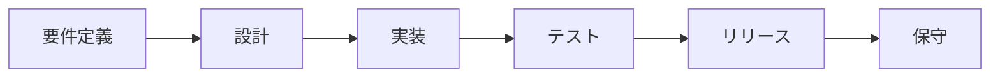
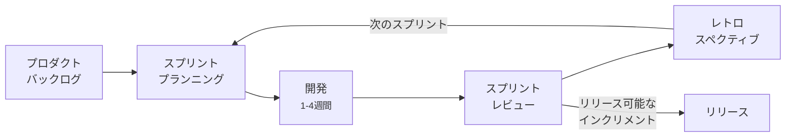
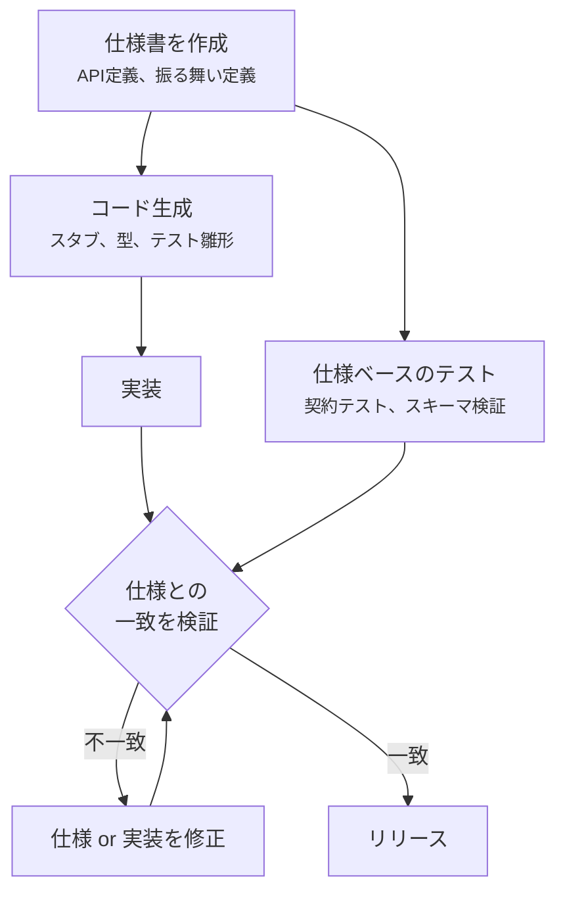
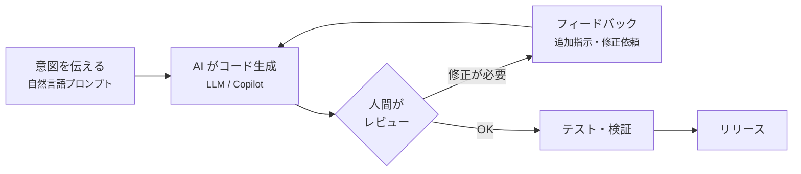
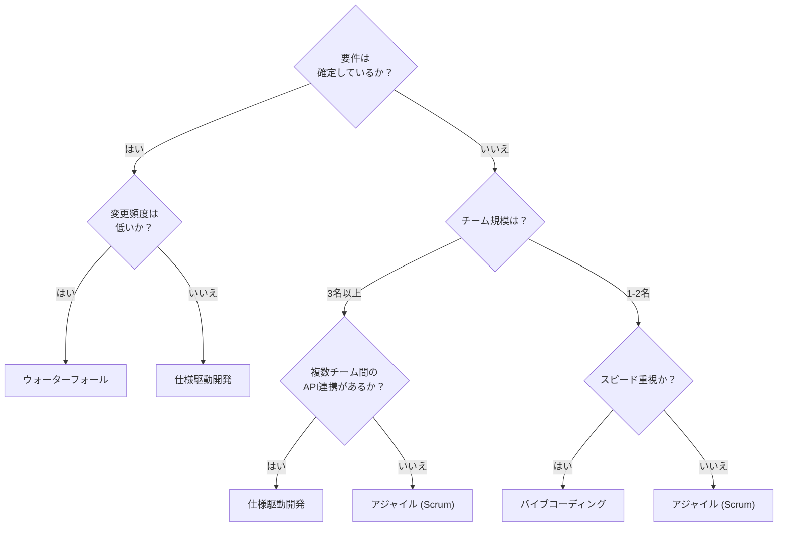
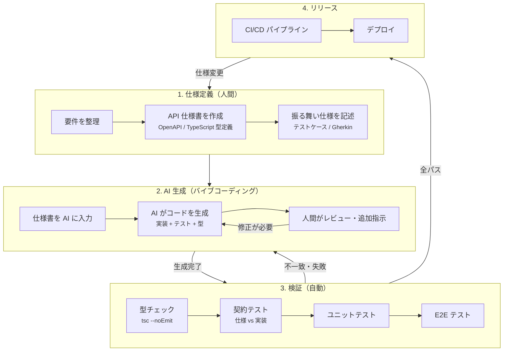

# 開発手法の比較 — ウォーターフォール / アジャイル (Scrum) / 仕様駆動開発 (SDD) / バイブコーディング

更新日: 2026-03-20

## 1. 概要

ソフトウェア開発手法は、プロジェクトの特性・チーム規模・変更頻度に応じて選択する。\
本ドキュメントでは、Web アプリケーション（フロントエンド + バックエンド）開発を前提に、代表的な 4 つの手法の違いを構造的に比較する。

| 手法 | 一言で表すと |
| --- | --- |
| ウォーターフォール | 計画を完成させてから作る |
| アジャイル (Scrum) | 動くものを繰り返し作りながら改善する |
| 仕様駆動開発 (SDD) | 仕様書を正とし、仕様と実装を同期させる |
| バイブコーディング | AI に意図を伝え、コードを生成させる |

## 2. 各手法の詳細

### 2.1 ウォーターフォール

**思想:** 工程を順序通りに進め、前工程の成果物を次工程の入力とする。\
後戻りを最小化することで、品質と予測可能性を確保する。

**特徴:**

- 各工程に明確な成果物（要件定義書、設計書、テスト仕様書）がある
- 工程間のレビュー・承認ゲートで品質を担保する
- スケジュールとコストの見積もりが立てやすい
- 要件変更が発生すると、上流からのやり直しコストが大きい

**Web アプリ開発での適用:**

| レイヤー | 進め方 |
| --- | --- |
| フロントエンド | 画面設計書・ワイヤーフレームを完成させてから UI 実装に着手する |
| バックエンド | API 設計書・DB 設計書を確定してから実装する |
| 連携 | フロントエンドはバックエンドの API 完成を待つため、並行開発が難しい |

**向いているプロジェクト:**

- 要件が明確で変更が少ない（法規制対応、基幹システム）
- 契約上、成果物とスケジュールの確定が必要
- 大規模な受託開発

### 2.2 アジャイル (Scrum)

**思想:** 短いサイクル（スプリント）で動くソフトウェアを繰り返しリリースし、フィードバックを取り込みながら方向修正する。

**Scrum のロール:**

| ロール | 責務 |
| --- | --- |
| プロダクトオーナー (PO) | バックログの優先順位を決定する。\\ビジネス価値の最大化に責任を持つ。 |
| スクラムマスター (SM) | Scrum プロセスの守護者。\\障害を取り除き、チームの自己組織化を支援する。 |
| 開発チーム | スプリント内でインクリメントを完成させる。\\職能横断的で自己組織的なチーム。 |

**Scrum のイベント:**

| イベント | タイミング | 目的 |
| --- | --- | --- |
| スプリントプランニング | スプリント開始時 | 何を作るか、どう作るかを決める |
| デイリースクラム | 毎日 15 分 | 進捗の同期と障害の早期発見 |
| スプリントレビュー | スプリント終了時 | インクリメントをステークホルダーに見せる |
| レトロスペクティブ | スプリント終了後 | プロセスの改善点を議論する |

**特徴:**

- 変化に強い。要件の追加・変更をスプリント単位で取り込める。
- 早期にリスクを検出できる。\\動くソフトウェアを短期間で確認する。
- 継続的な改善。\\レトロスペクティブでプロセスを毎スプリント見直す。
- ドキュメントよりも動くソフトウェアを重視する。

**Web アプリ開発での適用:**

| レイヤー | 進め方 |
| --- | --- |
| フロントエンド | スプリント内で UI コンポーネントを実装し、レビューでフィードバックを受ける |
| バックエンド | 同じスプリントで API エンドポイントを実装する |
| 連携 | モック API やスタブを使い、フロントエンドとバックエンドを並行開発できる |

**向いているプロジェクト:**

- 要件が不確実で、ユーザーフィードバックが重要
- 市場投入スピードが求められる
- 小〜中規模のチーム（3〜9 名）

### 2.3 仕様駆動開発 (SDD: Specification-Driven Development)

**思想:** 仕様書を開発の起点とし、仕様と実装の一致を常に検証する。\
仕様書は「ドキュメント」ではなく「実行可能な契約」として機能する。

**SDD の成果物:**

| 成果物 | 役割 |
| --- | --- |
| API 仕様（OpenAPI 等） | エンドポイント・型・制約の定義 |
| 振る舞い仕様（Gherkin 等） | ユーザーシナリオの形式化 |
| 型定義（TypeScript, Protocol Buffers） | インターフェースの契約 |
| 契約テスト | 仕様と実装の自動検証 |

**特徴:**

- 仕様と実装の乖離を自動検出する
- API ファーストで、フロントエンドとバックエンドの並行開発が可能
- 仕様書がそのまま最新のドキュメントになる
- 初期の仕様定義コストが高い

**Web アプリ開発での適用:**

| レイヤー | 進め方 |
| --- | --- |
| フロントエンド | TypeScript 型定義・コンポーネント Props を仕様として定義し、型に従って実装する |
| バックエンド | OpenAPI 仕様から API ルート・バリデーション・テストを生成する |
| 連携 | API 仕様（OpenAPI）が契約となり、フロントエンドとバックエンドが完全に独立して開発できる |

**向いているプロジェクト:**

- マイクロサービスアーキテクチャ
- 複数チーム間の API 連携が多い
- 長期的な保守性が重要

### 2.4 バイブコーディング (Vibe Coding)

**思想:** 開発者が自然言語で意図を伝え、AI がコードを生成する。\
「コードを書く」から「コードを導く」へのパラダイムシフト。\
2025 年に Andrej Karpathy が提唱した概念で、AI を共同開発者として扱う手法。

**バイブコーディングのワークフロー:**

| ステップ | 内容 |
| --- | --- |
| 意図の表明 | 自然言語で「何を作りたいか」を AI に伝える |
| コード生成 | AI がコード・テスト・設定を生成する |
| レビュー・修正 | 生成されたコードを確認し、必要に応じて追加指示を出す |
| 反復 | 対話的にコードを洗練させる |
| 検証 | テスト実行・ビルド検証で品質を担保する |

**特徴:**

- 開発速度が劇的に向上する。\\プロトタイプを数分〜数時間で作成できる。
- プログラミング経験が浅い人でもソフトウェアを作れる。
- 「何を作るか」の思考に集中でき、「どう書くか」の負荷が下がる。
- AI の出力を検証・理解する能力が必要（盲目的な信頼は危険）。
- 大規模なアーキテクチャ設計やドメイン知識は人間が担う。

**リスクと留意点:**

- AI が生成したコードのセキュリティ脆弱性を見逃す可能性がある
- コードベースの一貫性が崩れやすい（異なるプロンプトで異なるスタイルが混在）
- AI に依存しすぎると、コードの理解・保守が困難になる
- ライセンス・著作権の問題（学習データに含まれるコードの利用）

**Web アプリ開発での適用:**

| レイヤー | 進め方 |
| --- | --- |
| フロントエンド | 「この画面を React + MUI で作って」とプロンプトで指示し、コンポーネントを生成する |
| バックエンド | 「このデータモデルの CRUD API を Next.js API Routes で作って」と指示する |
| 連携 | AI が型定義から API クライアントコードも同時に生成できる。\ただしフロントエンド/バックエンド間の整合性は人間が検証する。 |

**向いているプロジェクト:**

- プロトタイピング・MVP 開発
- 個人開発・少人数チーム
- 定型的なコード（CRUD、設定、テスト）の大量生成
- 既存コードベースへの機能追加・バグ修正

> バイブコーディングは単独の開発手法というよりも、他の手法と組み合わせて使う「加速装置」として位置づけるのが現実的である。\
> Scrum のスプリント内で AI を活用する、SDD の仕様からコードを AI に生成させる、といった使い方が効果的。

## 3. 比較表

| 観点 | ウォーターフォール | アジャイル (Scrum) | 仕様駆動開発 (SDD) | バイブコーディング |
| --- | --- | --- | --- | --- |
| 計画の粒度 | プロジェクト全体を事前に計画 | スプリント単位で計画 | 仕様単位で計画 | タスク単位（プロンプト） |
| 変更への対応 | 高コスト（手戻り） | 低コスト（次スプリントで対応） | 中コスト（仕様変更→再生成） | 極低コスト（再プロンプト） |
| 成果物 | 各工程のドキュメント | 動くインクリメント | 仕様書 + 生成コード + テスト | 生成コード + 対話ログ |
| フィードバック | リリース後 | スプリントごと | 仕様レビュー + 契約テスト | リアルタイム（対話中） |
| リスク検出 | 遅い（テスト工程で発覚） | 早い（各スプリントで確認） | 早い（仕様段階で検出） | 即時（生成直後に検証） |
| ドキュメント | 重厚（工程ごとに作成） | 軽量（必要最小限） | 中程度（仕様書が自動的にドキュメント） | 最小（意図的に作らないと残らない） |
| チーム規模 | 大規模向き | 小〜中規模向き | 規模を問わない | 個人〜少人数向き |
| 初期コスト | 高（要件定義・設計に時間） | 低（すぐに開発開始） | 中（仕様定義に時間） | 最低（即座に生成開始） |

## 4. 手法の選択基準

> 実際のプロジェクトでは、1つの手法を厳密に適用するよりも、プロジェクトの特性に応じて組み合わせることが多い。\
> 例: Scrum のスプリント運営 + SDD の API 仕様管理、ウォーターフォールの上流工程 + アジャイルの実装工程。

## 5. 組み合わせの実例

| 組み合わせ | 適用場面 |
| --- | --- |
| Scrum + SDD | API 連携の多いプロダクト開発。\\スプリント内で仕様定義→コード生成→実装→契約テストを回す。 |
| Scrum + バイブコーディング | スプリント内の実装・テスト作成を AI で加速する。\\PO がバックログを管理し、開発者が AI と対話して実装する。 |
| SDD + バイブコーディング | 仕様書から AI にコード・テストを生成させ、契約テストで検証する。\\仕様の精度が AI の出力品質を決める。 |
| ウォーターフォール + Scrum | 要件定義・基本設計はウォーターフォールで確定し、詳細設計以降をスプリントで実施する。 |
| ウォーターフォール + SDD | 受託開発で API 仕様を契約に含め、仕様駆動で実装・検証する。 |

### 5.1 SDD + バイブコーディング ワークフロー

仕様の精度が AI の出力品質を決める。\
仕様書を「AI への最良のプロンプト」として位置づけ、仕様→生成→検証のサイクルを高速に回す。

**各フェーズの詳細:**

| フェーズ | 担当 | 成果物 | ポイント |
| --- | --- | --- | --- |
| 1. 仕様定義 | 人間 | API 仕様書、型定義、テストケース | 仕様の精度 = AI 出力の品質。\曖昧さを排除する。 |
| 2. AI 生成 | AI + 人間 | 実装コード、テストコード | 仕様書をコンテキストとして AI に渡す。\生成結果を人間が検証・修正指示する。 |
| 3. 検証 | 自動 | テスト結果、カバレッジレポート | 仕様と実装の一致を自動検証する。\不一致はフェーズ 2 に戻る。 |
| 4. リリース | 自動 | デプロイ済みアプリケーション | CI/CD で全検証をパスした場合のみリリース。 |

**実践のコツ:**

- 仕様書は AI が解釈しやすい形式で書く（OpenAPI YAML、TypeScript interface、箇条書きの制約条件）
- AI への指示は「仕様書の該当セクション + 実装指示」をセットで渡す
- 生成されたコードは必ず契約テストで検証する。\AI の出力を盲目的に信頼しない。
- 仕様変更時は仕様書を先に更新し、AI に再生成させる。\コードを直接修正しない。

> **Anytime Markdown の開発は、このワークフローに近い。**\
> 設計書（`/anytime-markdown-docs/design/`）とキーボードショートカット仕様（`/anytime-markdown-docs/spec/`）を仕様として管理し、Claude Code（AI）がコード生成・テスト作成・レビューを担当している。\
> SonarCloud と GitHub Actions が自動検証レイヤーとして機能する。
