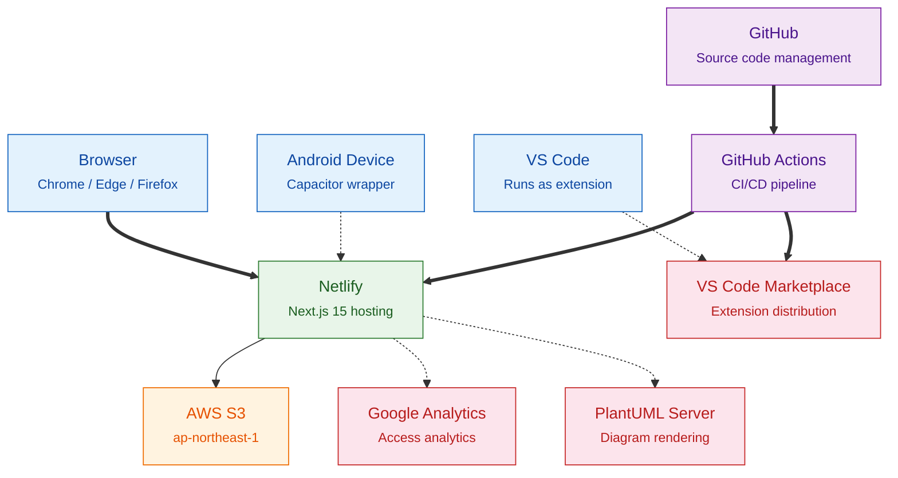
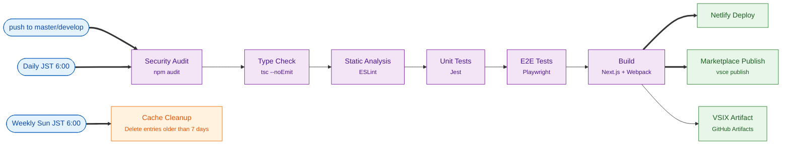
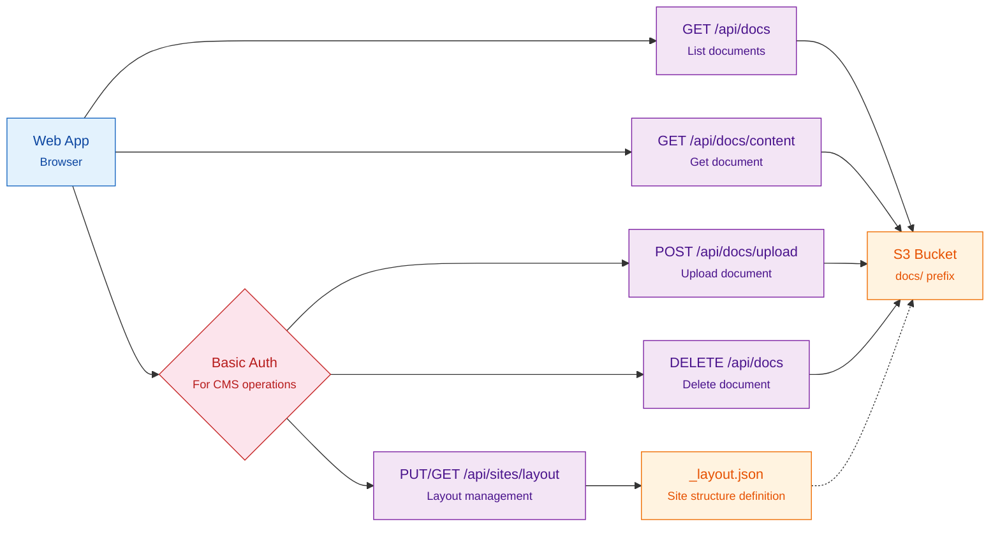
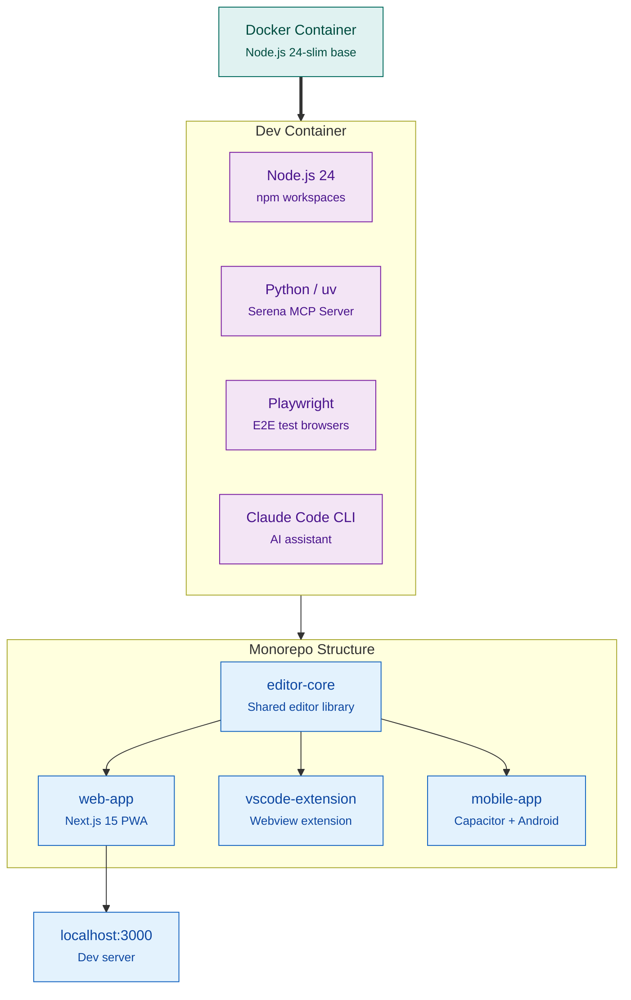

# Infrastructure Diagram

Updated: 2026-03-08

## 1. Overall Architecture

| Color | Category | Targets |
| --- | --- | --- |
| Blue | User / Client | Browser, VS Code, Android device |
| Green | Hosting | Netlify |
| Orange | Storage | AWS S3 |
| Purple | CI/CD | GitHub, GitHub Actions |
| Red | External services | Google Analytics, PlantUML, Marketplace |

## 2. CI/CD Pipeline

| Color | Category | Targets |
| --- | --- | --- |
| Blue | Trigger | push, scheduled runs |
| Purple | Step | Audit, type check, lint, tests, build |
| Green | Artifact / Deploy | Netlify deploy, Marketplace publish, VSIX |
| Orange | Schedule | Cache cleanup |

## 3. Data Flow (Document Management)

| Color | Category | Targets |
| --- | --- | --- |
| Blue | Client | Web app |
| Purple | API Endpoint | List, get, upload, delete, layout |
| Orange | Storage | S3 bucket, `_layout.json` |
| Red | Auth | Basic auth |

## 4. Development Environment

| Color | Category | Targets |
| --- | --- | --- |
| Teal | Container | Docker |
| Purple | Tools | Node.js, Python, Playwright, Claude Code CLI |
| Blue | Runtime / Packages | editor-core, web-app, vscode-extension, mobile-app, dev server |

## 5. Component List

### 5.1 Hosting & Storage

| Service | Purpose | Region |
| --- | --- | --- |
| Netlify | Web app hosting | Auto |
| AWS S3 | Document storage | `ap-northeast-1` |
| VS Code Marketplace | Extension distribution | - |
| GitHub | Source code management / CI/CD | - |

### 5.2 External Services

| Service | Purpose | Required |
| --- | --- | :---: |
| Google Analytics | Access analytics | x |
| PlantUML Server | Diagram rendering | x |

### 5.3 Auth & Security

| Target | Method | Environment Variables |
| --- | --- | --- |
| CMS operations (S3) | Basic auth | `CMS_BASIC_USER` / `CMS_BASIC_PASSWORD` |
| Marketplace publish | Personal Access Token | `VSCE_PAT` (GitHub Secrets) |
| AWS S3 access | IAM access key | `ANYTIME_AWS_ACCESS_KEY_ID` / `ANYTIME_AWS_SECRET_ACCESS_KEY` |

### 5.4 Build Artifacts

| Artifact | Output Path | Distribution |
| --- | --- | --- |
| Web app | `.next/` | Netlify |
| Static HTML (mobile) | `web-app/out/` | Capacitor |
| VSIX package | `vscode-extension/*.vsix` | Marketplace / GitHub Artifacts |
| Android APK/AAB | `mobile-app/android/app/build/outputs/` | Play Store (manual) |
