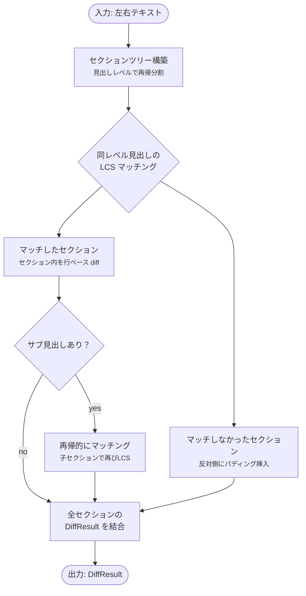

# セマンティック比較 設計書

更新日: 2026-03-17


## 概要

Markdown テキストを見出し単位でセクション分割し、見出しテキストの LCS でマッチング後、セクション単位で diff を実行する。\
片側にのみ存在するセクションにはパディング（空白領域）を挿入して位置を揃える。\
サブ見出しで再帰的にマッチングする。


## 現状と課題

現在の `computeDiff` は純粋な行ベース LCS で、Markdown の構造を一切考慮しない。\
見出しの追加・削除・順序変更があると、後続の全行が「変更」として表示され、実質的な差分が埋もれる。


## 設計


### データ構造

```typescript
/** 見出しで分割されたセクション */
interface MarkdownSection {
  heading: string | null;     // 見出しテキスト（ルートセクションは null）
  level: number;              // 見出しレベル（1-5、ルートは 0）
  headingLine: string;        // 見出し行の原文（"## 設計方針" 等）
  bodyLines: string[];        // 見出し直後〜次の同レベル見出しまでの行
  children: MarkdownSection[];// サブ見出しのセクション
}

/** セクションマッチング結果 */
interface SectionMatch {
  type: "matched" | "left-only" | "right-only";
  left: MarkdownSection | null;
  right: MarkdownSection | null;
}
```


### アルゴリズム




### 処理フロー

**Step 1: セクションツリー構築**

テキストを行単位で走査し、見出し行（`^#{1,5}\s`）を検出してツリーを構築する。

- ルートセクション: 最初の見出しより前の行（frontmatter 除外済み前提）
- 見出し検出時: 現在のレベル以上の見出しが来たらセクション終了
- サブ見出し: 現在より深いレベルの見出しは子セクションとして再帰的に格納

**Step 2: LCS マッチング**

同一レベルのセクション配列に対し、見出しテキスト（`#` を除いた文字列）で LCS を計算する。

- LCS に含まれるペア → `matched`
- 左のみに残ったセクション → `left-only`
- 右のみに残ったセクション → `right-only`
- 出現順序を維持してインターリーブする

**Step 3: セクション単位 diff**

- `matched`: 見出し行同士を比較 + bodyLines を現行 `computeDiff` で比較
- `left-only`: 全行を `removed` として出力、右側に同行数のパディング挿入
- `right-only`: 全行を `added` として出力、左側に同行数のパディング挿入

**Step 4: 再帰処理**

マッチしたセクションの子セクション（サブ見出し）に対して Step 2-3 を再帰的に適用する。

**Step 5: 結合**

全セクションの `DiffLine[]` を出現順に結合し、単一の `DiffResult` を生成する。\
既存の `DiffResult` 型（`leftLines`, `rightLines`, `blocks`）はそのまま維持する。


### 適用モード

| モード | 適用方法 |
| --- | --- |
| ソースモード | `computeSemanticDiff` の `DiffResult` をそのまま使用（行ベース表示） |
| WYSIWYG モード | セクション単位でマッチした ProseMirror ノード群に対して `computeBlockDiff` を適用 |


### API

```typescript
/** セマンティック比較（見出しベース） */
function computeSemanticDiff(
  leftText: string,
  rightText: string,
  options?: DiffOptions,
): DiffResult;
```

- 戻り値は既存の `DiffResult` と同じ型
- `useMergeDiff` のオプションとして `semantic: boolean` を追加
- UI にトグルボタンを追加して行ベース/セマンティック切替


### 影響範囲

| ファイル | 変更内容 |
| --- | --- |
| `utils/diffEngine.ts` | `computeSemanticDiff` 関数を追加 |
| `hooks/useMergeDiff.ts` | `semantic` オプション追加、diff 関数の切替 |
| `components/InlineMergeView.tsx` | セマンティック切替トグル UI 追加 |
| `hooks/useDiffHighlight.ts` | WYSIWYG モードでセクション単位ハイライト対応 |
| `i18n/en.json`, `i18n/ja.json` | トグルラベル追加 |


### テスト方針

- `computeSemanticDiff` の純粋関数テスト（TDD）:
    - 同一見出し構造の比較
    - 見出し追加/削除
    - 見出し順序変更
    - サブ見出しの再帰マッチング
    - 見出しなしテキスト（フォールバック）
- 既存の `computeDiff` テストは変更なし


### リスク

| リスク | 対策 |
| --- | --- |
| 見出しのないテキストでセマンティック比較が無意味 | 見出しが 0 件の場合は `computeDiff` にフォールバック |
| 同名の見出しが複数存在する場合のマッチング曖昧性 | LCS により出現順で最も近いペアを優先 |
| 大きなセクション（数百行）でのパフォーマンス | セクション分割後は既存の行ベース diff を流用するため、影響は限定的 |
