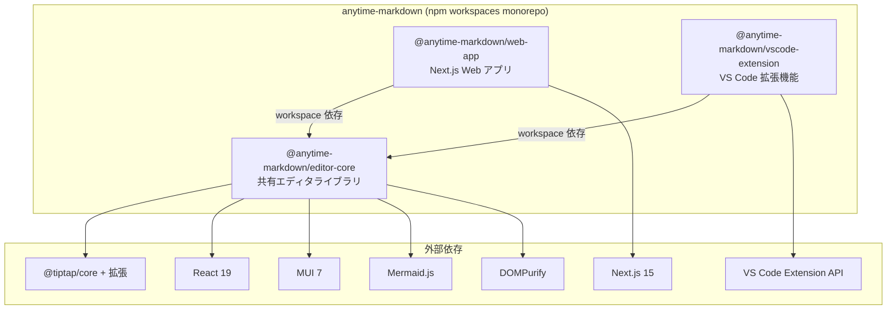
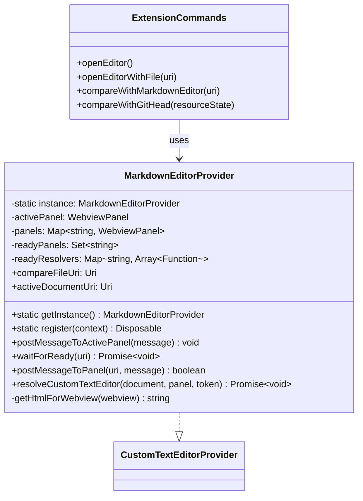
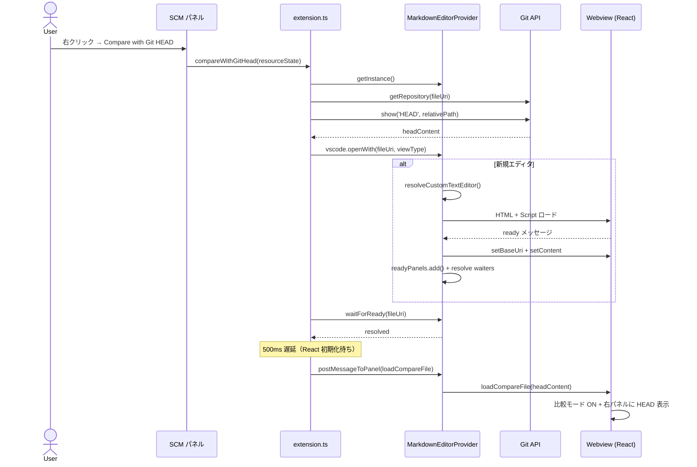
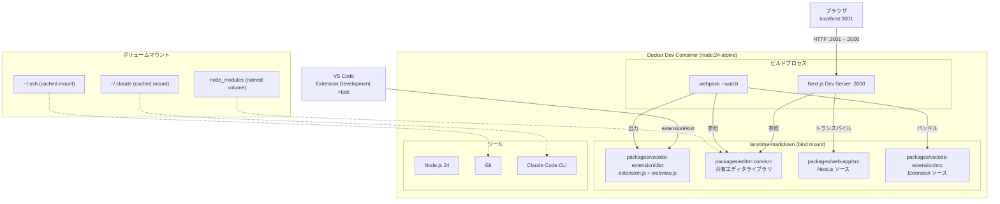

# Anytime Markdown - プロジェクト構成 UML

## パッケージ図



## コンポーネント図

```mermaid
graph TB
    subgraph "editor-core"
        MEP["MarkdownEditorPage<br/>メイン UI ページ"]

        subgraph "Hooks"
            UME["useMarkdownEditor<br/>状態管理"]
            UES["useEditorSettings<br/>設定管理"]
            UFO["useEditorFileOps<br/>ファイル操作"]
            USM["useSourceMode<br/>ソースモード"]
            UMD["useMergeDiff<br/>マージ/Diff"]
            UOL["useOutline<br/>アウトライン"]
        end

        subgraph "Components"
            ET["EditorToolbar"]
            SB["StatusBar"]
            BM["EditorBubbleMenu"]
            SR["SearchReplaceBar"]
            OP["OutlinePanel"]
            MP["MergeEditorPanel"]
            ESP["EditorSettingsPanel"]
        end

        subgraph "Tiptap Extensions"
            BE["getBaseExtensions"]
            CI["CustomImage"]
            CT["CustomTable"]
            CB["CodeBlockWithMermaid"]
            DH["DiffHighlight"]
            HF["HeadingFoldExtension"]
            SRE["SearchReplaceExtension"]
        end

        subgraph "Utils"
            DE["diffEngine"]
            SH["sectionHelpers"]
            TH["tableHelpers"]
            SM["sanitizeMarkdown"]
        end

        MEP --> UME
        MEP --> UES
        MEP --> UFO
        MEP --> USM
        MEP --> UMD
        MEP --> UOL
        MEP --> ET
        MEP --> SB
        MEP --> BM
        MEP --> SR
        MEP --> OP
        MEP --> MP
        MEP --> ESP
        UME --> BE
    end

    subgraph "web-app"
        Page["page.tsx<br/>エントリーポイント"]
        Layout["layout.tsx"]
        Providers["providers.tsx<br/>MUI + next-intl"]

        Layout --> Providers
        Page -->|"dynamic import<br/>ssr: false"| MEP
    end

    subgraph "vscode-extension"
        EXT["extension.ts<br/>コマンド登録"]
        MEPR["MarkdownEditorProvider<br/>CustomTextEditorProvider"]
        APP["App.tsx<br/>Webview エントリー"]
        VAPI["vscodeApi.ts<br/>API ラッパー"]
        SHIMS["shims/<br/>next-intl, next-dynamic"]

        EXT --> MEPR
        APP -->|"dynamic import"| MEP
        APP --> VAPI
        APP --> SHIMS
    end

```



## クラス図（VS Code 拡張）



## シーケンス図（SCM Compare with Git HEAD）



## 配置図（開発環境）



### 開発ワークフロー

| 環境 | 起動方法 | ビルド | アクセス |
| --- | --- | --- | --- |
| Web アプリ | `cd packages/web-app && npm run dev` | Next.js (HMR) | localhost:3001 |
| VS Code 拡張 | F5 (Launch Extension) | webpack --watch | Extension Development Host |
| 型チェック | `npx tsc --noEmit` | TypeScript | \- |

### ポートマッピング

| ホスト | コンテナ | 用途 |
| --- | --- | --- |
| 3001 | 3000 | Next.js Dev Server |

## ディレクトリ構成

```
anytime-markdown/
├── package.json                          # workspaces 定義
├── tsconfig.base.json                    # 共通 TypeScript 設定
├── packages/
│   ├── editor-core/                      # 共有エディタライブラリ
│   │   ├── package.json                  # peer dependencies
│   │   └── src/
│   │       ├── index.ts                  # 全エクスポート
│   │       ├── MarkdownEditorPage.tsx    # メイン UI ページ
│   │       ├── useMarkdownEditor.ts      # 状態管理フック
│   │       ├── useEditorSettings.ts      # 設定コンテキスト
│   │       ├── editorExtensions.ts       # Tiptap 拡張セット
│   │       ├── components/               # UI コンポーネント
│   │       ├── extensions/               # Tiptap カスタム拡張
│   │       ├── hooks/                    # カスタムフック
│   │       ├── utils/                    # ユーティリティ
│   │       ├── constants/                # 定数・テンプレート
│   │       ├── i18n/                     # en.json, ja.json
│   │       └── __tests__/               # ユニットテスト
│   ├── web-app/                          # Next.js Web アプリ
│   │   ├── package.json
│   │   └── src/app/
│   │       ├── page.tsx                  # エントリー（動的ロード）
│   │       ├── layout.tsx                # メタデータ + プロバイダー
│   │       └── providers.tsx             # MUI + next-intl
│   └── vscode-extension/                 # VS Code 拡張機能
│       ├── package.json                  # commands, menus, customEditors
│       └── src/
│           ├── extension.ts              # コマンド登録
│           ├── providers/
│           │   └── MarkdownEditorProvider.ts  # Custom Editor 実装
│           └── webview/
│               ├── index.tsx             # Webview エントリー
│               ├── App.tsx               # localStorage ブリッジ
│               ├── vscodeApi.ts          # VS Code API ラッパー
│               └── shims/               # next-intl, next-dynamic polyfill

```