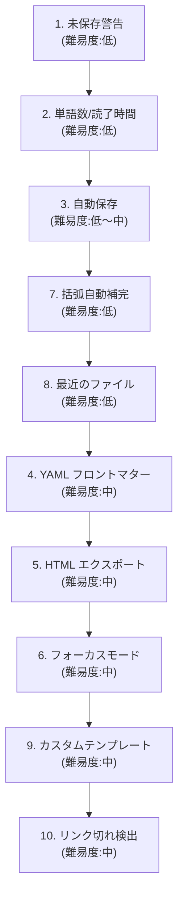

# Anytime Markdown 標準機能提案

作成日: 2026-03-09

## 概要

競合エディタ（Typora, Obsidian, Mark Text, Zettlr, VS Code built-in）と比較し、Markdown エディタとして不足している標準機能を整理する。\
既存機能の有無を調査した上で、優先度別に提案する。

## 現状の機能マップ

| 機能 | 状態 | 備考 |
| --- | --- | --- |
| PDF エクスポート | 実装済 | `window.print()` ベース |
| HTML エクスポート | 未実装 | |
| 印刷 | 実装済 | ダークモード図の自動変換あり |
| 文字数カウント | 実装済 | ステータスバー |
| 単語数/読了時間 | 未実装 | |
| 未保存警告 | 未実装 | `beforeunload` なし |
| 自動保存 | 未実装 | |
| スペルチェック | 未実装 | |
| 画像ドラッグ&ドロップ | 実装済 | クリップボード貼り付けも対応 |
| 目次生成 | 実装済 | `/toc` スラッシュコマンド |
| 検索/置換 | 実装済 | 正規表現対応 |
| キーボードショートカットカスタマイズ | 未実装 | プリセットのみ |
| テーマ/フォント設定 | 実装済 | サイズ、行間、最大幅、ダーク/ライト |
| 画像リサイズ | 実装済 | ドラッグハンドル |
| Undo/Redo | 実装済 | |
| アンカーリンク | 実装済 | GitHub 形式スラッグ |
| 脚注 | 実装済 | `[^id]` 記法 |
| テンプレート | 実装済 | 3種のビルトインテンプレート |
| フロントマター (YAML) | 未実装 | |
| フォーカスモード | 未実装 | |
| 括弧の自動補完 | 未実装 | |
| マルチカーソル | 未実装 | |
| リンク切れ検出 | 未実装 | |
| 最近開いたファイル | 未実装 | |

## 優先度: 高（ユーザーの基本体験に直結）

### 1. 未保存変更の警告（beforeunload）

ブラウザのタブを閉じる、ページ遷移する際に未保存の変更がある場合、警告ダイアログを表示する。

- **理由:** データ喪失はユーザー体験で最悪の事態。\
全ての競合エディタが実装している最低限の安全機構。
- **実装箇所:** Web アプリの `useEffect` で `beforeunload` イベントをリッスン
- **難易度:** 低

### 2. 単語数・読了時間の表示

ステータスバーに単語数と推定読了時間を表示する。

- **理由:** 文字数カウントは実装済みだが、技術文書やブログ執筆では単語数と読了時間が必須。\
Typora, Obsidian, Zettlr すべてが実装している。
- **実装箇所:** `StatusBar.tsx` に追加。\
日本語は形態素解析なしで「文字数 / 500 = 分」で概算可能。
- **難易度:** 低

### 3. 自動保存

一定時間（例: 5秒）操作がない場合に自動保存する。\
VS Code 拡張では既にデバウンス保存があるが、Web アプリには未実装。

- **理由:** ブラウザクラッシュやタブ誤閉じによるデータ喪失を防止する。\
`localStorage` または IndexedDB へのバックアップも含む。
- **実装箇所:** Web アプリの `useMarkdownEditor` フック内
- **難易度:** 低〜中

### 4. フロントマター（YAML）サポート

ドキュメント先頭の `---` で囲まれた YAML ブロックを認識し、メタデータとして扱う。

- **理由:** Hugo, Jekyll, Next.js, Astro 等の静的サイトジェネレータで必須。\
Obsidian, Zettlr は標準対応。\
フロントマターなしでは SSG ワークフローに組み込めない。
- **表示方法:** 折りたたみ可能なメタデータパネル、またはコードブロックとして表示
- **難易度:** 中

### 5. HTML エクスポート

現在のドキュメントをスタンドアロン HTML ファイルとしてエクスポートする。

- **理由:** PDF 印刷は実装済みだが、HTML 共有のニーズも高い。\
Mermaid 図や KaTeX 数式を含むドキュメントを、エディタなしで閲覧可能にする。
- **実装方法:** インラインCSS + SVG 埋め込みで自己完結した HTML を生成
- **難易度:** 中

## 優先度: 中（生産性と快適性の向上）

### 6. フォーカスモード / タイプライターモード

現在編集中の段落のみをハイライトし、他の段落を薄く表示する。\
タイプライターモードではカーソル行が常に画面中央に固定される。

- **理由:** 長文執筆時の集中力向上。\
Typora, iA Writer, Obsidian が実装しており、ライターに人気の機能。
- **実装箇所:** TipTap の `Decoration` でカーソル段落以外に半透明スタイルを適用
- **難易度:** 中

### 7. 括弧・引用符の自動補完

`(`, `[`, `{`, `` ` ``, `"`, `'` 入力時に対応する閉じ文字を自動挿入する。\
選択範囲がある場合は選択テキストを囲む。

- **理由:** ソースモードでの Markdown 記述効率を大幅に向上させる。\
VS Code, Typora 等では標準機能。
- **実装箇所:** ソースモードの `textarea` の `keydown` ハンドラ
- **難易度:** 低

### 8. 最近開いたファイル一覧

Web アプリで最近開いた/編集したファイルの履歴を表示する。

- **理由:** ファイルを再度開く際の導線が現状ない。\
`localStorage` にファイル名とタイムスタンプを保存し、起動画面に表示する。
- **難易度:** 低

### 9. カスタムテンプレート

ユーザーが独自のテンプレートを作成・登録できるようにする。

- **理由:** ビルトイン3種では業務固有のフォーマット（議事録、日報、設計書等）に対応できない。\
Obsidian の Templater、Zettlr のテンプレート機能に相当する。
- **実装方法:** テンプレートを `.md` ファイルとして保存し、スラッシュコマンドから挿入
- **難易度:** 中

### 10. リンク切れ検出

ドキュメント内のリンク（URL、アンカー、画像パス）を検証し、無効なリンクを警告する。

- **理由:** 技術文書では外部リンクの陳腐化が頻発する。\
エディタ内で検出できれば公開前に修正可能。
- **実装方法:** バックグラウンドで HTTP HEAD リクエスト、アンカーは DOM 内検索
- **難易度:** 中

## 優先度: 低（差別化・上級者向け）

### 11. スペルチェック

英語テキストのスペルミスを下線で表示する。

- **理由:** ブラウザネイティブの `spellcheck` 属性を活用すれば低コストで実装可能。\
ただし現在の `spellCheck={false}` は意図的な設定の可能性がある（コードブロック内の誤検出回避）。
- **難易度:** 低（ブラウザネイティブ）〜高（カスタム実装）

### 12. キーボードショートカットカスタマイズ

ユーザーがショートカットキーを再割り当てできるようにする。

- **理由:** Vim/Emacs キーバインドのユーザーや、他エディタからの移行者に重要。\
ただし現状のユーザー層では優先度は高くない。
- **難易度:** 高

### 13. マルチカーソル編集

複数箇所に同時にカーソルを配置して編集する。

- **理由:** VS Code ユーザーにはおなじみだが、WYSIWYG エディタでの実装は複雑。\
TipTap/ProseMirror の制約が大きい。
- **難易度:** 高

### 14. DOCX エクスポート

Microsoft Word 形式でエクスポートする。

- **理由:** ビジネス文書の共有で需要がある。\
`pandoc` や `docx-templates` ライブラリの活用が必要。
- **難易度:** 高

## 推奨の実装順序

> 難易度「低」の機能を先に実装し、少ないコストで体験を底上げする方針。\
> 特に項目1（未保存警告）はデータ喪失防止のため最優先で実装すべきである。
