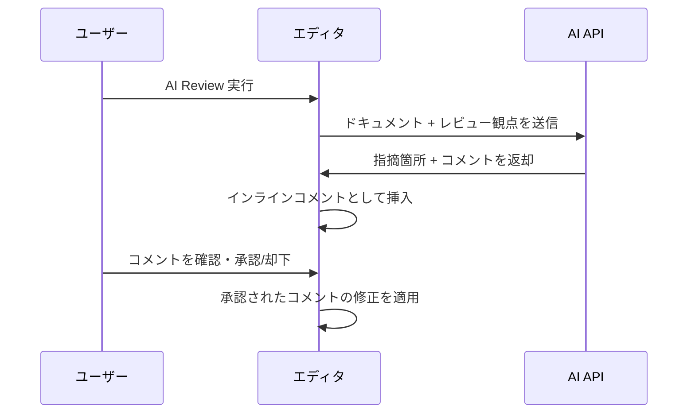
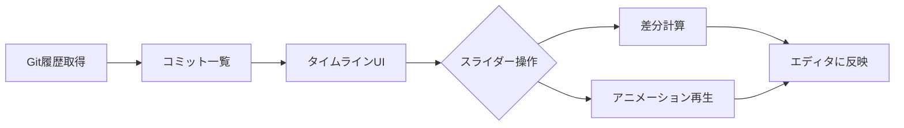

# Anytime Markdown 革新的機能提案

作成日: 2026-03-09

## 概要

他のMarkdownエディタでは実現していない、Anytime Markdown 独自の差別化機能を提案する。\
既存の強み（WYSIWYG + ソースモード、Mermaid/PlantUML、比較モード、インラインコメント）を活かし、「驚き」のある体験を提供する。

## 提案1: AI ドキュメントレビュー（Document Review Agent）

### 概要

Markdown ドキュメントに対して AI が「レビューコメント」をインラインコメント機能で直接挿入する。\
GitHub PR レビューのような UX をドキュメント単体で実現する。

### 既存ツールとの差別化

- Grammarly は文法チェックのみ
- GitHub Copilot はコード補完のみ
- **本機能は「構造・論理・技術的正確性」をレビューする**

### 機能詳細

- レビュー観点を選択可能（文章の曖昧さ、論理の飛躍、技術的誤り、読みやすさ）
- 既存のインラインコメント機能と完全統合
- コメントの承認/却下でドキュメントを改善するワークフロー
- VS Code のコマンドパレットから `Anytime: AI Review` で起動

### 実装イメージ

## 提案2: ライブダイアグラム同期（Diagram ↔ Text Bidirectional Sync）

### 概要

Mermaid/PlantUML のプレビュー図をドラッグ&ドロップで編集すると、コードが自動更新される。\
図の操作がそのままコードに反映される双方向同期を実現する。

### 既存ツールとの差別化

- draw.io はコード出力できるが Markdown 内に埋め込めない
- Mermaid Live Editor はコード→図の一方向のみ
- **本機能はプレビュー図の直接操作→コード自動更新を実現する**

### 機能詳細

- フローチャートのノードをドラッグで移動、矢印をクリックで接続先変更
- ノードのダブルクリックでラベルを直接編集
- 新しいノード/エッジの追加をGUIで操作
- 変更がリアルタイムにコードブロックへ反映

## 提案3: セマンティック差分（Semantic Diff）

### 概要

行ベースの差分に加え、Markdown の構造を理解した「意味的な差分」を表示する。\
段落の移動、表の構造変更、見出し階層の変更を認識する。

### 既存ツールとの差別化

- `git diff` も既存の比較ツールも行単位の差分のみ
- **本機能は Markdown の構造（見出し、段落、テーブル、リスト）を理解した差分を提供する**

### 機能詳細

| 検出対象 | 表示方法 |
| --- | --- |
| 段落の移動 | 移動元/先を矢印で接続 |
| 表の列追加/削除 | 列単位でハイライト |
| 見出し階層の変更 | ツリー差分で可視化 |
| リスト項目の並べ替え | 移動として認識（削除+追加ではなく） |

## 提案4: タイムトラベルエディタ（Document Timeline）

### 概要

編集履歴をタイムラインスライダーで可視化し、任意の時点の状態に戻れる。\
Git 連携で各コミット間の差分をアニメーション表示する。

### 既存ツールとの差別化

- Git blame は行単位の情報のみ
- Google Docs の履歴は粒度が粗い
- **本機能は「編集過程の再生」と「任意時点への復元」を提供する**

### 機能詳細

- タイムラインスライダーで編集履歴を時系列で表示
- スライダー操作で任意の時点のドキュメント状態をプレビュー
- Git コミット間の差分をアニメーション再生
- 「このドキュメントがどう進化したか」をプレゼンテーション可能
- VS Code の Git 履歴と統合

### 実装イメージ

## 提案5: コンテキストリンク（Context-Aware Cross-References）

### 概要

`[[ファイル名#見出し]]` 形式でプロジェクト内の他ドキュメントを参照する。\
リンク先の変更（見出し名変更、ファイル移動）を自動追従する。

### 既存ツールとの差別化

- Obsidian は独自アプリであり VS Code 内で動作しない
- **本機能は VS Code ワークスペース全体で動作し、IDE レベルのリファクタリング（一括リネーム）を提供する**

### 機能詳細

- `[[ファイル名#見出し]]` で他ドキュメントの特定セクションを参照
- リンク先の見出し名変更時にリンクを自動更新
- ファイル移動時にリンクパスを自動修正
- バックリンク一覧の表示（「このドキュメントを参照しているファイル」）
- リンク切れの検出と警告

## 提案6: プレゼンテーションモード（Slide Mode）

### 概要

`---` 区切りでスライド化し、エディタ内でそのままプレゼンできる。\
Mermaid 図表、KaTeX 数式、コードブロックのシンタックスハイライトがそのまま表示される。

### 既存ツールとの差別化

- Marp はビルドが必要
- Slidev は Vue 依存
- **本機能は「編集中の Markdown をゼロ設定で即スライド表示」を実現する**

### 機能詳細

- `---` でスライド区切り
- スライドモード切替ボタンで即座にプレゼン開始
- Mermaid 図、KaTeX 数式、シンタックスハイライトがそのまま描画
- キーボード/マウスでスライド送り
- スピーカーノート対応（`<!-- notes: ... -->` 記法）
- PDF エクスポート

## 推奨の優先順位

| 順位 | 機能 | インパクト | 実装難易度 | 理由 |
| --- | --- | --- | --- | --- |
| 1 | プレゼンテーションモード | 高 | 中 | 即効性が高く、他ツールにない体験を提供 |
| 2 | タイムトラベルエディタ | 高 | 中 | Git 連携が既にあり、拡張しやすい |
| 3 | AI ドキュメントレビュー | 高 | 中 | インラインコメント機能と統合可能 |
| 4 | コンテキストリンク | 中 | 中 | VS Code 拡張の差別化になる |
| 5 | セマンティック差分 | 中 | 高 | 比較モードの強化として自然 |
| 6 | ライブダイアグラム同期 | 高 | 高 | 技術的課題が大きいが実現すればインパクト最大 |

> 優先順位は「実現した場合のユーザーインパクト」と「既存アーキテクチャとの親和性」で決定した。
