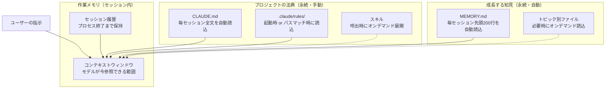

# Claude Code のメモリを理解する — セッションを超えて知識を引き継ぐ仕組み

更新日: 2026-03-21\
著者: Claude Code v2.1.71 (claude-opus-4-6)\
編集・監修: Kiyotaka Ueda\
利用スキル: tech-article (2026-03-11)、markdown-output (2026-03-11)

> **AI 生成コンテンツに関する注意事項**
>
> この記事は AI（Claude Code）によって生成されたものである。内容の正確性には注意を払っているが、以下の点に留意されたい。
>
> - 記載内容は執筆時点（2026-03-11）の情報に基づく。Claude Code のバージョンアップにより仕様が変更される可能性がある
> - 具体的な数値（遵守率、トークン数等）は公式ドキュメントや既知の情報に基づくが、環境や条件によって異なる場合がある
> - 最新の正確な情報は [公式ドキュメント](https://code.claude.com/docs/en/memory) を参照すること
> - 記事中の SVG イラストは AI が生成したものであり、概念の理解を助ける目的で挿入している


## はじめに

Claude Code を使っていて、「さっき教えたのに、また同じことを聞かれた」と感じたことはないだろうか。\
この問題の原因は、Claude Code のメモリの仕組みを理解していないことにある。

Claude Code は毎セッション、まっさらなコンテキストウィンドウから始まる。\
しかし、正しく設定すれば、プロジェクトのルール・過去の知見・個人の好みをセッションをまたいで引き継げる。

この記事では、Claude Code のメモリアーキテクチャを **3つのレイヤー** に分けて整理し、「どこに何を書けば、いつ読み込まれるのか」を明確にする。


## 前提知識

- Claude Code の基本操作（セッション開始・スラッシュコマンド）を理解している
- `CLAUDE.md` の存在を知っている（未設定でも可）
- ターミナルでの作業に慣れている


## メモリの3つのレイヤー

Claude Code の記憶は、性質によって3つのレイヤーに分かれる。\
まずこの全体像をおさえることで、個々の機能がどこに位置するか見通しがよくなる。

| レイヤー | 性質 | 何が入るか | いつ消えるか |
| --- | --- | --- | --- |
| 作業メモリ | 一時的 | 会話履歴、ツール出力、ファイル内容 | セッション終了 or 圧縮時 |
| プロジェクトの法典 | 永続・手動 | コーディング規約、ビルド手順、アーキテクチャ方針 | ファイルを削除するまで |
| 成長する知見 | 永続・自動 | デバッグの知見、ワークフロー習慣、学習パターン | ファイルを削除するまで |

以下の図は、各レイヤーの情報がコンテキストウィンドウにどう流れ込むかを示している。



> 実線はセッション開始時に自動ロードされる情報、点線はオンデマンドでロードされる情報を示す。


## レイヤー1: 作業メモリ — セッション内の一時的な情報

作業メモリは、いま進行中の会話で Claude が参照できる情報の範囲である。\
人間の「短期記憶」に相当し、セッションが終われば消える。


### コンテキストウィンドウ

モデルが1回の応答生成時に参照できるトークンの範囲を指す。\
以下の情報が含まれる。

- `CLAUDE.md` と `MEMORY.md`（セッション開始時に自動注入）
- 直近の会話履歴
- ツール実行結果（`Read`、`Bash` 等の出力）
- スキルの指示内容（呼び出し時に展開）

上限に達すると、古いメッセージが自動的に圧縮され、要約に置き換わる。


### セッション履歴

Claude Code の1回の対話全体を保持する仕組みである。

- プロセスを終了するまで継続する
- `claude -c` で前回のセッションを引き継いで再開できる
- コンテキストウィンドウに収まらない部分は圧縮済みの状態で保持される


### Session Memory（v2.1.30 以降）

バックグラウンドで継続的にサマリーを書き出す仕組みである。\
この機能により、`/compact` は事前に書かれたサマリーをロードするだけで即座に完了する。

自動コンパクトは、バッファが約 33,000 トークン（16.5%）まで縮小した時点でトリガーされる。

> **重要**: `/compact` 後も `CLAUDE.md` はディスクから再読込されるため、指示が失われることはない。\
> 一方、会話内でのみ与えた指示は圧縮時に失われる可能性がある。\
> 永続化が必要な指示は `CLAUDE.md` に書くこと。


## レイヤー2: プロジェクトの法典 — チームで共有する永続的なルール

「法典」とは、プロジェクトで守るべきルールや手順を指す。\
ユーザーが手動で作成・管理し、セッションをまたいで常に適用される。


### CLAUDE.md — メモリの中核

結論から言うと、**CLAUDE.md は 200 行以下に保つべきである**。\
200 行以下のファイルはルール適用率 92% 以上を達成するが、400 行を超えると 71% に低下する。\
また、箇条書き形式は段落文と比べて指示遵守率が 60% 向上する。

CLAUDE.md はマークダウンファイルで、プロジェクトのルールと指示を記載する。\
Claude はセッション開始時にこのファイルを全文読み込み、コンテキストに注入する。

#### 配置場所と優先度

スコープが狭いほど優先度が高くなる。

| スコープ | 場所 | 共有範囲 |
| --- | --- | --- |
| マネージドポリシー | macOS: `/Library/Application Support/ClaudeCode/CLAUDE.md`、Linux/WSL: `/etc/claude-code/CLAUDE.md` | 組織内全ユーザー |
| プロジェクト | `./CLAUDE.md` または `./.claude/CLAUDE.md` | ソース管理経由でチーム |
| ユーザー | `~/.claude/CLAUDE.md` | 個人のみ（全プロジェクト共通） |

> **注意**: マネージドポリシーの CLAUDE.md は `claudeMdExcludes` で除外できない。\
> 組織のセキュリティポリシーが常に適用されることを保証する仕組みである。

#### ロードの仕組み

- 作業ディレクトリから上方向にディレクトリツリーを走査し、各階層の CLAUDE.md をロードする
- サブディレクトリの CLAUDE.md は、Claude がそのディレクトリ内のファイルを読んだときにオンデマンドでロードされる
- ファイル長に関係なく全文がロードされる（ただし 200 行以下が推奨）

#### インポート機能

`@path/to/file` 構文で外部ファイルを読み込める。

```markdown
See @README for project overview.
Git workflow: @docs/git-instructions.md
Personal prefs: @~/.claude/my-project-instructions.md
```

- 相対パス・絶対パスの両方に対応する
- 再帰インポートは最大 5 ホップまで
- 初回は承認ダイアログが表示される

#### 追加ディレクトリの CLAUDE.md をロードする

```bash
CLAUDE_CODE_ADDITIONAL_DIRECTORIES_CLAUDE_MD=1 claude --add-dir ../shared-config
```

#### 不要な CLAUDE.md を除外する

モノレポで他チームの CLAUDE.md が読み込まれる場合、`.claude/settings.local.json` でスキップできる。

```json
{
  "claudeMdExcludes": [
    "**/monorepo/CLAUDE.md",
    "/home/user/monorepo/other-team/.claude/rules/**"
  ]
}
```


### `.claude/rules/` — モジュラールール

CLAUDE.md が肥大化したら、トピックごとのファイルに分割できる。

```
.claude/
├── CLAUDE.md
└── rules/
    ├── code-style.md
    ├── testing.md
    └── security.md
```

- `.md` ファイルを再帰的に検出する
- `paths` フロントマターなしのルールは起動時にロードされる
- シンボリックリンクに対応している（循環リンクも検出・処理）

#### パススコープルール — 必要なときだけロードする

YAML フロントマターの `paths` フィールドで、特定のファイルにスコープを限定できる。\
Claude がマッチするファイルを読んだときにのみコンテキストにロードされるため、トークンの節約になる。

```markdown
---
paths:
  - "src/api/**/*.ts"
  - "src/**/*.{ts,tsx}"
---

# API 開発ルール
- 全エンドポイントに入力バリデーションを含める
- OpenAPI ドキュメントコメントを付与する
```

よく使う glob パターンは以下のとおりである。

| やりたいこと | パターン |
| --- | --- |
| 全 TypeScript ファイルに適用 | `**/*.ts` |
| src 配下の全ファイルに適用 | `src/**/*` |
| 複数拡張子に適用 | `src/**/*.{ts,tsx}` |
| 特定ディレクトリに限定 | `src/components/*.tsx` |

#### ユーザーレベルルール

`~/.claude/rules/` に配置すると、全プロジェクトで個人ルールが適用される。\
プロジェクトルールが優先されるため、チーム規約と個人設定が衝突しても安全である。


### スキル — 特定タスク時だけ展開される手順書

スキルは、特定タスクの手順・ルールを定義するファイルである。

- 配置場所: `~/.claude/skills/<skill-name>/SKILL.md`
- `/skill-name` で呼び出すと、コンテキストウィンドウに展開される
- 常時ロードされないため、コンテキストを消費しない

つまり、`CLAUDE.md` が「常に適用されるルール」で、スキルが「必要なときだけ参照する手順書」である。

> 例: `/production-release` でリリース手順を展開し、`/test-spec-generator` で試験項目書の生成手順を展開する。


## レイヤー3: 成長する知見 — Claude が自律的に蓄積するメモ

Auto Memory は、Claude がセッション中に自動的に書くメモの仕組みである。\
ビルドコマンド、デバッグの知見、コードスタイルの好み、ワークフロー習慣などを保存する。

ユーザーが何も設定しなくても、Claude は「次のセッションで役立つ」と判断した情報を自ら記録する。


### 保存場所

```
~/.claude/projects/<project>/memory/
├── MEMORY.md          # インデックス（毎セッション先頭200行をロード）
├── debugging.md       # トピック別の詳細メモ
├── api-conventions.md
└── ...
```

- `<project>` パスは Git リポジトリから導出される
- 同一リポジトリの全 worktree・サブディレクトリで1つのメモリを共有する
- マシンローカルであり、他マシン・クラウド環境とは共有されない


### ロード動作 — 200 行の法則

`MEMORY.md` の**先頭 200 行だけ**が毎セッション開始時に自動ロードされる。\
200 行を超えた部分はロードされない。

Claude はこの制限を踏まえ、`MEMORY.md` を簡潔なインデックスとして維持する。\
詳細な情報はトピック別ファイル（`debugging.md` 等）に移動し、必要なときにオンデマンドで読み込む。

> この 200 行制限は `MEMORY.md` にのみ適用される。\
> `CLAUDE.md` はファイル長に関係なく全文ロードされる（ただし短いほど遵守率は高い）。


### Auto Memory の設定

| やりたいこと | 方法 |
| --- | --- |
| オン/オフを切り替える | `/memory` コマンドでトグル |
| プロジェクト単位で無効化する | 設定に `"autoMemoryEnabled": false` を追加 |
| CI/自動化環境で無効化する | `CLAUDE_CODE_DISABLE_AUTO_MEMORY=1` を設定 |
| 保存された内容を確認する | `/memory` でフォルダを開く |
| 特定のメモを削除する | 該当ファイルを手動で削除・編集 |

> Auto Memory のファイルはすべてプレーン Markdown である。\
> いつでも手動で閲覧・編集・削除できる。

サブエージェントも独自の Auto Memory を保持できる。\
詳細は [サブエージェント設定](https://code.claude.com/docs/en/sub-agents#enable-persistent-memory) を参照。


## 実践ガイド: やりたいこと別コマンドリファレンス


### メモリを管理する

| やりたいこと | コマンド |
| --- | --- |
| ロード中のメモリファイルを確認する | `/memory` |
| CLAUDE.md を自動生成する | `/init` |
| Auto Memory のオン/オフを切り替える | `/memory` でトグル |


### コンテキストを管理する

| やりたいこと | コマンド | 使いどき |
| --- | --- | --- |
| 使用量を確認する | `/context` | コンテキストの残量が気になるとき |
| 会話を圧縮する | `/compact [instructions]` | 使用率が 80% を超えたとき |
| 会話履歴を完全にクリアする | `/clear` | タスクを切り替えるとき |

> `/compact` はオプションで保持したい情報を指示できる。\
> 例: `/compact retain the error handling patterns`


### セッションを管理する

| やりたいこと | コマンド |
| --- | --- |
| 前回の会話を再開する | `claude -c` または `/resume` |
| 特定のセッションを再開する | `claude -r "session-name"` |
| 会話を分岐させる | `/fork [name]` |
| セッション名を変更する | `/rename [name]` |
| 会話をエクスポートする | `/export [filename]` |
| コードを過去の状態に戻す | `/rewind` |
| 変更の差分を確認する | `/diff` |

#### CLI フラグ

| フラグ | 説明 |
| --- | --- |
| `claude -c` | 現在のディレクトリで最新の会話を継続する |
| `claude -r "<session>"` | セッション ID または名前を指定して再開する |
| `claude --fork-session` | 元のセッションを変更せず分岐する |
| `claude --from-pr 123` | 特定の GitHub PR に紐づくセッションを再開する |
| `claude --no-session-persistence` | セッションをディスクに保存しない（`-p` モード専用） |
| `claude -w <name>` | 分離された Git worktree でセッションを開始する |


### 記憶をリセットする

| 何をリセットしたいか | 方法 | 影響範囲 |
| --- | --- | --- |
| 会話履歴だけ消す | `/clear` | 現セッションの会話のみ。CLAUDE.md・Auto Memory は維持 |
| コンテキストを圧縮する | `/compact` | 会話を要約に置換。CLAUDE.md はディスクから再読込 |
| 特定の Auto Memory を消す | `/memory` でフォルダを開き、ファイルを手動削除 | 削除したファイルは次セッション以降ロードされない |
| Auto Memory を全削除する | `~/.claude/projects/<project>/memory/` 内を全削除 | 当該プロジェクトの学習がリセットされる |
| Auto Memory を無効化する | 設定 or 環境変数で無効化 | Claude がメモを書かなくなる（既存ファイルは残る） |
| CLAUDE.md をリセットする | ファイルを直接削除・編集 | 次セッションから反映される |


### キーボードショートカット

| ショートカット | 説明 |
| --- | --- |
| `Ctrl+C` | 現在の入力または生成をキャンセルする |
| `Ctrl+D` | セッションを終了する |
| `Ctrl+L` | ターミナル画面をクリアする（会話履歴は維持） |
| `Ctrl+B` | 実行中のコマンドをバックグラウンドに移行する |
| `Ctrl+T` | タスクリストの表示/非表示を切り替える |
| `Esc` + `Esc` | 巻き戻し（rewind）またはサマライズ |
| `Shift+Tab` | パーミッションモードを切り替える |


## セッションを跨いで情報を引き継ぐ方法

| 方法 | 特徴 | 確実性 | 適した用途 |
| --- | --- | --- | --- |
| `CLAUDE.md` に記載 | 毎セッション全文がロードされる | 最高 | コーディング規約、ビルド手順、重要な設計決定 |
| `.claude/rules/` に記載 | 起動時 or パスマッチ時にロードされる | 高 | ファイル種別ごとのルール |
| `MEMORY.md` に記録 | 先頭 200 行が自動ロードされる | 中 | 学習した知見、パターン |
| `claude -c` / `/resume` | セッション履歴をそのまま延長する | — | 中断した作業の再開 |
| ドキュメントファイル | 必要時に `Read` で参照される | 低 | 設計書、仕様書 |
| Git の状態 | コードの変更履歴として残る | 低 | 実装の経緯 |

> **注意**: 確実性が「中」以下の方法は、Claude が能動的に読みに行かない限り参照されない。\
> 重要な設計決定（採用したアーキテクチャ方針、フォルダ構成等）は `CLAUDE.md` または `.claude/rules/` に記載するのが最も確実である。


## トラブルシューティング


### CLAUDE.md の指示が守られない

CLAUDE.md はコンテキストであり、強制ではない。\
以下を確認する。

1. `/memory` でファイルがロードされているか確認する
2. 指示をより具体的にする（「コードを整形」→「2スペースインデントを使用」）
3. 複数の CLAUDE.md 間で矛盾がないか確認する

> **Tips**: `InstructionsLoaded` フックを使うと、どのファイルがいつロードされたかをログに記録できる。\
> パススコープルールのデバッグに有用である。


### `/compact` 後に指示が消えた

CLAUDE.md に書かれた指示は `/compact` 後も維持される。\
消えた指示は、会話内でのみ伝えたものである。\
永続化が必要な指示は CLAUDE.md に追記すること。


### Auto Memory に何が保存されたかわからない

`/memory` を実行し、Auto Memory フォルダを開く。\
すべてプレーン Markdown なので、そのまま閲覧・編集・削除できる。


### 別セッションで保存したメモリが認識されない

Auto Memory はセッション**開始時**に `MEMORY.md` を読み込む。そのため以下の制約がある。

1. **MEMORY.md 未登録**: メモリファイルが存在しても `MEMORY.md` のインデックスに登録されていなければ、セッション開始時に認識されない
2. **並行セッション**: セッション A でメモリを追加しても、既に開始済みのセッション B には反映されない（セッション C を新規開始すれば反映される）
3. **200 行超過**: `MEMORY.md` が 200 行を超えると、後半のエントリが読み込まれない

**対策:**

- メモリファイルの作成と `MEMORY.md` への登録は**必ず同時に**行う
- 別セッションで決まった重要事項がある場合、新セッション開始時にユーザーが「○○についてメモリを確認して」と明示的に伝える
- 重要な設計決定は Auto Memory だけに頼らず、`CLAUDE.md` やドキュメントにも記載する

> **教訓（2026-03-21）:** 別セッションで決定した S3 フォルダ構成がメモリファイルとして保存されていたが、後続セッションで認識できなかった。メモリファイル自体は存在していたが、`MEMORY.md` のインデックスに未登録（または別セッション開始後に追加）だったことが原因。重要な設計決定は Auto Memory だけに頼らず、`CLAUDE.md` や設計書にも記載すべきである。


## サードパーティのメモリ拡張（参考）

Claude Code の標準メモリ機能を超える永続性が必要な場合、以下のツールが利用できる。

| ツール | 概要 |
| --- | --- |
| claude-mem | セッション内容を自動キャプチャし AI で圧縮、次回セッションに注入する |
| memsearch | 汎用の永続メモリライブラリ。任意のエージェントフレームワークに対応する |
| claude-supermemory | リアルタイム学習・知識更新プラグイン |
| engram | SQLite + FTS5 ベースの永続メモリ。MCP サーバー・HTTP API・CLI・TUI に対応する |
| mcp-memory-service | ナレッジグラフ + 自動統合による永続メモリ |


## まとめ

- Claude Code のメモリは **作業メモリ**（セッション内）、**プロジェクトの法典**（CLAUDE.md / rules）、**成長する知見**（Auto Memory）の3レイヤーで構成される
- `CLAUDE.md` は **200 行以下** に保つと遵守率 92% 以上を維持できる
- `MEMORY.md` は **先頭 200 行** のみ自動ロードされる。詳細はトピックファイルに分割する
- `/compact` は会話を圧縮するが `CLAUDE.md` は維持される。永続化したい指示は会話ではなくファイルに書く
- Auto Memory は便利だが、`MEMORY.md` 未登録や並行セッション間の非共有といった制約がある。重要な決定事項は `CLAUDE.md` にも記載するのが最も確実
- コマンド一覧やリセット方法は「やりたいこと」から逆引きできる


## 参考リンク

- [公式ドキュメント: Memory](https://code.claude.com/docs/en/memory)
- [公式ドキュメント: Settings](https://code.claude.com/docs/en/settings)
- [公式ドキュメント: Skills](https://code.claude.com/docs/en/skills)
- [公式ドキュメント: Sub-agents](https://code.claude.com/docs/en/sub-agents)
- [公式ドキュメント: CLI Reference](https://code.claude.com/docs/en/cli-reference)
- [公式ドキュメント: Interactive Mode](https://code.claude.com/docs/en/interactive-mode)
- [Memory Tool (API)](https://platform.claude.com/docs/en/agents-and-tools/tool-use/memory-tool)
