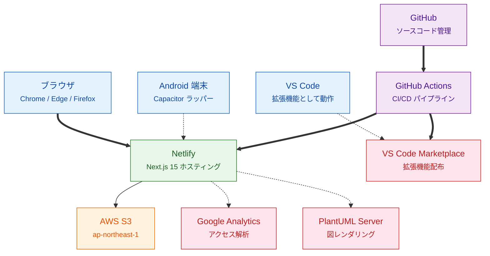
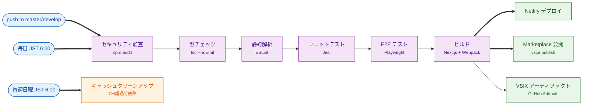
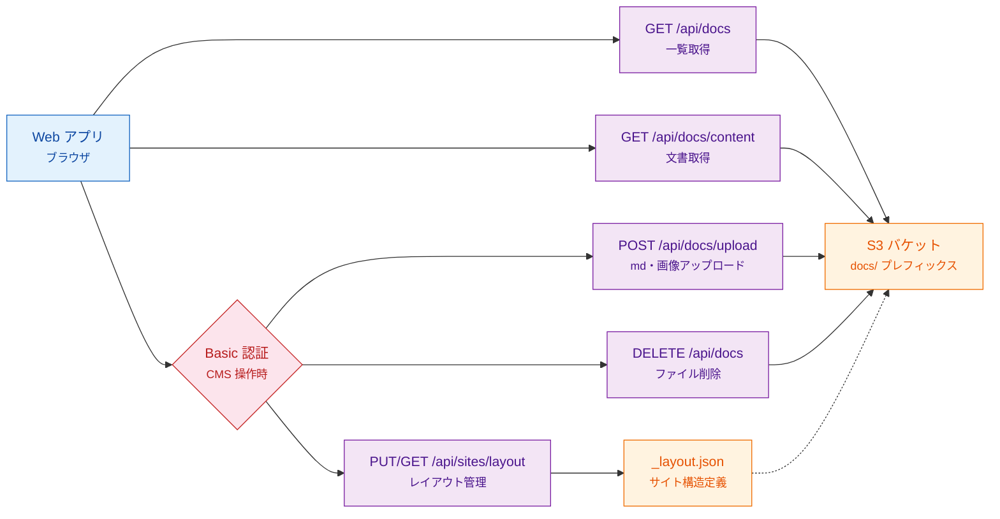
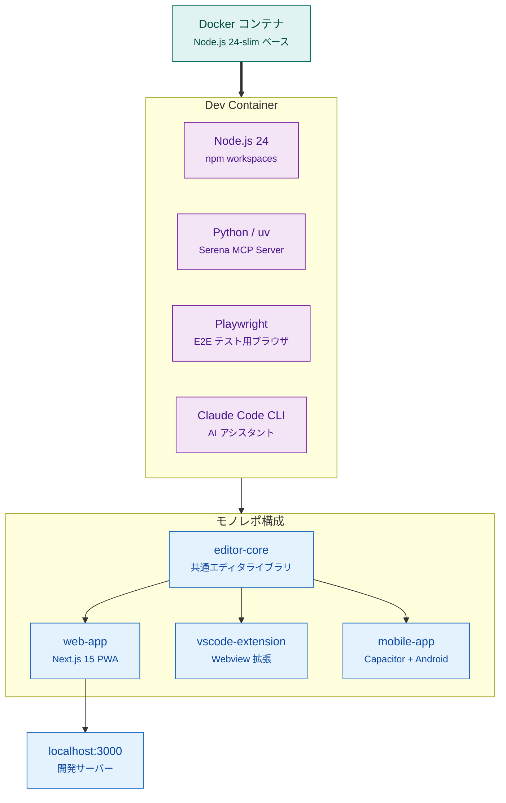

# インフラ構成

更新日: 2026-03-21

Anytime Markdown のインフラ構成を図と表で整理したドキュメント。
全体構成、CI/CD、データフロー、開発環境、S3 フォルダ構成を含む。


## 1. 全体構成

ブラウザ・VS Code・Android の3プラットフォームから利用できる。
ホスティングは Netlify、ドキュメント格納は AWS S3 を使用する。



| 色 | 分類 | 対象 |
| --- | --- | --- |
| 青 | ユーザー / クライアント | ブラウザ、VS Code、Android 端末 |
| 緑 | ホスティング | Netlify |
| 橙 | ストレージ | AWS S3 |
| 紫 | CI/CD | GitHub、GitHub Actions |
| 赤 | 外部サービス | Google Analytics、PlantUML、Marketplace |


## 2. CI/CD パイプライン

GitHub Actions による自動化パイプライン。push 時のビルド・テスト・デプロイに加え、定期的なセキュリティ監査を実施する。



| 色 | 分類 | 対象 |
| --- | --- | --- |
| 青 | トリガー | push、定期実行 |
| 紫 | ステップ | 監査、型チェック、Lint、テスト、ビルド |
| 緑 | 成果物 / デプロイ | Netlify デプロイ、Marketplace 公開、VSIX |
| 橙 | スケジュール | キャッシュクリーンアップ |


## 3. データフロー（ドキュメント管理）

ランディングページのドキュメント表示・CMS 操作（アップロード・削除・レイアウト管理）のデータフロー。
CMS 操作は Basic 認証で保護される。



| 色 | 分類 | 対象 |
| --- | --- | --- |
| 青 | クライアント | Web アプリ |
| 紫 | API エンドポイント | 一覧、取得、アップロード、削除、レイアウト |
| 橙 | ストレージ | S3 バケット、`_layout.json` |
| 赤 | 認証 | Basic 認証 |


## 4. 開発環境

Docker Dev Container 上で開発する。Node.js モノレポ構成で、editor-core を共有ライブラリとして各プラットフォームが利用する。



| 色 | 分類 | 対象 |
| --- | --- | --- |
| 青緑 | コンテナ | Docker |
| 紫 | ツール | Node.js、Python、Playwright、Claude Code CLI |
| 青 | ランタイム / パッケージ | editor-core、web-app、vscode-extension、mobile-app、開発サーバー |


## 5. 構成要素一覧

各サービス・ツールの詳細仕様。

### 5.1 ホスティング・ストレージ

| サービス | 用途 | リージョン |
| --- | --- | --- |
| Netlify | Web アプリホスティング | 自動 |
| AWS S3 | ドキュメント格納 | `ap-northeast-1` |
| VS Code Marketplace | 拡張機能配布 | - |
| GitHub | ソースコード管理・CI/CD | - |


### 5.2 S3 フォルダ構成

トピック別フォルダ + 言語別 md + 画像共有の構成を採用。

```
s3://{S3_DOCS_BUCKET}/
└── {S3_DOCS_PREFIX}/              # デフォルト: "docs/"
    ├── _layout.json               # サイト構造定義（カテゴリ・アイテム）
    ├── getting-started/
    │   ├── index-ja.md            # 日本語ドキュメント
    │   ├── index-en.md            # 英語ドキュメント
    │   └── images/                # 画像は言語共通
    │       ├── install-step1.png
    │       └── install-step2.png
    ├── features/
    │   ├── index-ja.md
    │   ├── index-en.md
    │   └── images/
    │       ├── editor-preview.png
    │       └── split-view.gif
    └── infrastructure/
        ├── index-ja.md
        ├── index-en.md
        └── images/
            └── architecture.png
```

| 項目 | 規則 |
| --- | --- |
| トピックフォルダ | `{topic}/` — 1 トピックにつき 1 フォルダ |
| 日本語 md | `index-ja.md` |
| 英語 md | `index-en.md` |
| 画像フォルダ | `{topic}/images/` — 言語間で共有 |
| 言語固有の画像 | `{topic}/images/{name}-ja.png` のように命名で対応 |
| md 内の画像参照 | 相対パス `` |
| `_layout.json` の key | `docs/features/index-ja.md` 形式 |
| URL パラメータ | `?key=docs/features/index-ja.md` |

> 画像の相対パスは `/api/docs/content` が返却時に CloudFront URL（または API URL）に自動変換する。


### 5.3 外部サービス


| サービス | 用途 | 必須 |
| --- | --- | :---: |
| Google Analytics | アクセス解析 | x |
| PlantUML Server | 図のレンダリング | x |


### 5.4 認証・セキュリティ

| 対象 | 方式 | 環境変数 |
| --- | --- | --- |
| CMS 操作（S3） | Basic 認証 | `CMS_BASIC_USER` / `CMS_BASIC_PASSWORD` |
| Marketplace 公開 | Personal Access Token | `VSCE_PAT`（GitHub Secrets） |
| AWS S3 アクセス | IAM アクセスキー | `ANYTIME_AWS_ACCESS_KEY_ID` / `ANYTIME_AWS_SECRET_ACCESS_KEY` |


### 5.5 ビルド成果物

| 成果物 | 出力先 | 配布先 |
| --- | --- | --- |
| Web アプリ | `.next/` | Netlify |
| 静的 HTML（モバイル用） | `web-app/out/` | Capacitor |
| VSIX パッケージ | `vscode-extension/*.vsix` | Marketplace / GitHub Artifacts |
| Android APK/AAB | `mobile-app/android/app/build/outputs/` | Play Store（手動） |
